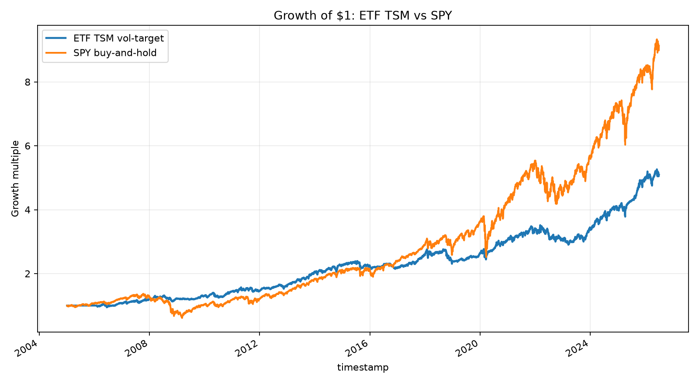
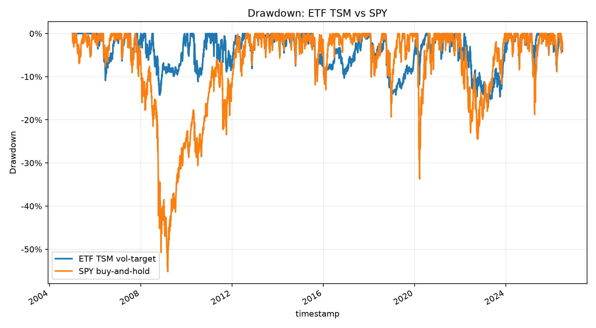

# mfs-trader

Experimental Python strategy-research and validation workbench with simulated execution. Strategies are hypotheses, not assets: freeze the decision path, evaluate it with explicit costs and a statistical gauntlet, and preserve failed as well as successful evidence.

The intended release surface is credential-free research and simulation—not a qualified broker-paper campaign, live-trading system, or investment recommendation. Paper-runtime engineering checks and any future broker qualification are separate evidence.

Numerical-correction notice: historical MC/DSR validation claims below require re-evaluation and are withdrawn as current validation claims. The corrected code does not retroactively approve any Experiment. Original evidence and stored lifecycle fields remain unchanged; see the [correction and evidence-migration note](docs/numerical-correctness-2026-09-16.md).

## Why this repo exists

Most trading repos show a backtest. This repo tries to show the harder engineering loop:

1. Predeclare a source-backed hypothesis.
2. Freeze the exact Experiment snapshot: strategy, parameters, universe, data version, costs, risk profile, portfolio config, git commit, and seed.
3. Run an honest Validation Gauntlet: walk-forward analysis, Monte Carlo, Deflated Sharpe Ratio, and parameter stability.
4. Archive both passes and failures as immutable evidence.
5. Gate paper/live operation behind broker reconciliation, risk controls, caps, kill switches, and manual promotion confirmations.

## Current status

- Package: `mfs-trader`
- Primary language: Python 3.11+
- Historical candidate: `ETFTimeSeriesMomentumVolTarget-v1-YahooAdjustedDaily-2005-2026`
- Stored promotion status: `validation_passed` (historical metadata, not corrected validation approval)
- Paper/live status: not approved; affected validation evidence requires re-evaluation before relying on its PASS
- Latest mechanism scout: `CrossAssetCarryTrendScout-v1` passed all 13 frozen public-data gates; next evidence step is a five-market raw-contract replication, not paper/live promotion

## Historical candidate — requires re-evaluation

The following are unchanged historical report values, not results from the corrected numerical implementation.

| Experiment | Data | Status | Sharpe | WFA OOS Sharpe | MC P(ruin) | DSR p-value | Max DD | Notes |
| --- | --- | --- | ---: | ---: | ---: | ---: | ---: | --- |
| `ETFTimeSeriesMomentumVolTarget-v1` | Yahoo adjusted daily ETFs, 2005-2026 | `validation_passed` | 0.7954 | 0.8386 | 0.0001 | 3.48e-07 | -17.30% | Source-backed ETF absolute momentum + inverse-volatility / volatility-targeting rules |

Evidence:

- Validation report: `experiments/119131fa-0f67-48d7-ab87-f20d81c70c1f/validation/report.md`
- Frozen metadata: `experiments/119131fa-0f67-48d7-ab87-f20d81c70c1f/metadata.json`
- Source memo: `docs/strategy_sources/ETFTimeSeriesMomentumVolTarget-v1.md`
- SPY comparison: `docs/reports/etf_tsm_spy_comparison.md`
- Runtime/sim-broker replay: `docs/reports/etf_tsm_engine_replay/etf_tsm_engine_replay.md`

### ETF TSM vs SPY

Using the same cached Yahoo adjusted daily data panel:

| Metric | ETF TSM vol-target | SPY buy-and-hold |
| --- | ---: | ---: |
| Total return | 4.09x | 8.13x |
| CAGR | 7.89% | 10.86% |
| Sharpe | 0.7954 | 0.6388 |
| Sortino | 1.0009 | 0.7805 |
| Annual volatility | 10.20% | 18.96% |
| Max drawdown | -17.30% | -55.19% |
| Final equity | $50,944.37 | $91,284.71 |





Historical interpretation: SPY had higher absolute return over this sample, while the reported ETF TSM metrics showed better risk-adjusted behavior and smaller drawdowns. These comparisons are not a substitute for corrected validation or permission to proceed to paper/live operation.

### ETF TSM runtime replay

The historical candidate also has a runtime replay through the engine, portfolio sizing, risk checks, OMS, SQLite order/position state, and simulated broker fills:

| Check | Result |
| --- | ---: |
| Bars/cycles | 5,405 / 5,405 |
| Orders submitted/filled/rejected/timed out | 1,072 / 1,072 / 0 / 0 |
| Operational blockers | 0 |
| Structural replay status | PASS (historical) |

Report: `docs/reports/etf_tsm_engine_replay/etf_tsm_engine_replay.md`.

Scope: this historical PASS establishes completion of the operational simulation, **not financial execution parity**. Research final equity was $50,944.37 versus runtime $27,759.42, a $23,184.95 difference. The aggregate gap alone does not attribute timing, sizing, costs, rounding, or risk-control effects. It is neither corrected statistical validation nor Alpaca paper/live approval.

### Evidence boundaries

| Evidence | What it can establish | What it cannot establish |
| --- | --- | --- |
| Original validation report | What the historical implementation computed | Corrected MC/DSR qualification |
| Versioned corrected evaluation | Corrected validation under recorded inputs, trials, costs, and source version | Automatic lifecycle transition or execution permission |
| Structural replay | Runtime cycles, orders, reconciliation, and operational blockers | Research/runtime financial agreement |
| Execution-parity comparison | Ledger agreement under explicitly identical assumptions, or attributed differences | Broker fill quality or elapsed paper qualification |
| Offline paper safety tests | Tested evidence and recovery behavior under simulated faults | Real broker sessions, reconciled trades, slippage, or operator sign-off |

Broker-paper qualification is **NOT ESTABLISHED**. Synthetic drills do not satisfy the required elapsed window, eligible exchange sessions, or observed broker fills. Publication remains an owner action; no remote release or deployment is implied.

## Latest research scouts

### Cross-asset futures carry plus trend

`CrossAssetCarryTrendScout-v1` tested a predeclared 15-market futures carry/trend portfolio on the public `pst-group/pysystemtrade` panel pinned to commit `883c8681cf880d83acad5c39b842403a8eac5676`. The panel covers 2010-01-04 through 2024-03-28 and is suitable for mechanism falsification, not deployment validation.

After independent implementation review and a complete rerun, the scout passed all 13 frozen gates:

| Portfolio | Total return | CAGR | Sharpe | Annual volatility | Max drawdown |
| --- | ---: | ---: | ---: | ---: | ---: |
| Carry/trend gross | 168.26% | 6.97% | 0.6566 | 11.22% | -27.40% |
| Carry/trend net at 2 bps | 147.72% | 6.39% | 0.6080 | 11.22% | -29.18% |
| SPY | 502.20% | 13.03% | 0.8069 | 16.98% | -33.72% |
| 100% SPY + 20% scout overlay | 629.57% | 14.52% | 0.8711 | 17.30% | -32.58% |
| 100% SPY + 50% scout overlay | 859.49% | 16.68% | 0.9360 | 18.28% | -30.89% |

The standalone scout did not beat SPY's absolute or risk-adjusted return. Its value was low correlation to SPY (`0.0761`) and improved portfolio utility as a futures overlay. The overlay rows add futures exposure on top of 100% SPY; they are not 80/20 or 50/50 allocations.

All leave-one-asset-class-out Sharpes remained positive, both frozen subperiods had Sharpe above `0.61`, the strategy remained profitable at 5 bps one-way costs, the largest absolute asset-class P&L share was 27.27%, and the best 12 positive months contributed 37.17% of positive monthly P&L.

Evidence:

- Frozen specification and audit corrections: `docs/strategy_sources/CrossAssetCarryTrendScout-v1.md`
- Full report: `docs/reports/cross_asset_carry_trend_scout.md`
- Machine-readable report: `docs/reports/cross_asset_carry_trend_scout.json`
- Data-feasibility memo: `docs/research_scout/DataFeasibilityEarningsFutures-v1.md`

This PASS authorizes only a bounded raw-contract replication for ES, ZN, CL, GC, and ZC using an auditable source. It does not establish deployable alpha or authorize paper/live trading.

### Fundamental-event smart reversal

`FundamentalEventSmartReversal-v1` tested whether vetoing recent SEC-disclosure-associated moves could rescue short-term cross-sectional reversal. The point-in-time event pipeline covered material 8-K, 8-K/A, 10-Q, 10-Q/A, 10-K, 10-K/A, 6-K, and 6-K/A filings.

The frozen scout failed and was not tuned after the result:

| Portfolio | Total return | CAGR | Sharpe | Max drawdown |
| --- | ---: | ---: | ---: | ---: |
| Strategy gross | -5.56% | -0.69% | -0.0084 | -36.70% |
| Strategy net | -43.47% | -6.69% | -0.5748 | -50.56% |
| SPY | 219.35% | 15.14% | 0.8421 | -33.79% |

The signal had no gross edge, its mean Rank IC had the wrong sign for reversal, and its SPY overlay reduced portfolio utility. The SEC filter is therefore documented as a disclosure-associated move veto, not a complete fundamental-news classifier.

Evidence:

- Frozen specification: `docs/strategy_sources/FundamentalEventSmartReversal-v1.md`
- Full report: `docs/reports/fundamental_event_smart_reversal_scout.md`
- Postmortem: `docs/reports/fundamental_event_smart_reversal_lessons.md`
- Institutional strategy survey: `docs/research_scout/InstitutionalSystematicStrategyCandidates-v1.md`

## Failed honestly, not tuned after the fact

| Experiment | Verdict | Why it matters |
| --- | --- | --- |
| `ResidualReversalStatArb-v1-LiquidLargeCapDaily-AlpacaSIP` | Failed validation | Headline collapse was decomposed into weak gross signal plus extreme turnover/cost drag; not rescued by post-result tuning. See `docs/adr/0004-decompose-turnover-cost-drag-before-strategy-verdicts.md`. |
| `ETFTacticalMomentum-v1-Daily-2010-2026` | Failed validation | Monte Carlo was healthier, but WFA/DSR missed thresholds. The adjacent `top_n=2` row was not promoted after seeing results. |
| `ResidualVolMomentum-v1-LargeCapDaily-2018-2026` | Failed validation | Failed WFA, MC, and DSR decisively; archived rather than paper-traded. |

This failure archive is intentional. The gauntlet is the strategy-selection engine.

## Architecture

```text
config/          TOML config and typed schema
storage/         SQLite event/order state and Parquet market data helpers
data/            Alpaca/Yahoo/CCXT-style download, validation, resampling
strategies/      Pure signal/target-weight strategy templates
research/        Vectorized research, sweeps, source-backed pipelines
validation/      WFA, Monte Carlo, DSR, and parameter-stability gauntlet
experiments/     Immutable Experiment registry, hashes, promotion status, artifacts
portfolio/       Target-position and sizing logic
risk/            Exposure, drawdown, sector/correlation, and kill-switch checks
execution/       Broker adapters, simulated broker, OMS, order state machine
engine/          Runtime loop, replay, shakedown, paper/live gate commands
monitoring/      Operational report and alert plumbing
tests/           Unit, integration, replay, and contract tests
```

Core design docs:

- System plan: `docs/PLAN.md`
- Domain vocabulary and promotion rules: `CONTEXT.md`
- Artifact manager ADR: `docs/adr/0001-artifact-manager-owns-canonical-experiment-artifacts.md`
- Paper broker authority ADR: `docs/adr/0003-alpaca-paper-runs-are-one-shot-gated-broker-sessions.md`

## Validation Gauntlet

A frozen Experiment must pass all four checks before it can be considered for paper ops:

1. Walk-forward analysis: OOS Sharpe/Sortino and fold stability.
2. Monte Carlo: block-bootstrap path stress, P(loss), P(ruin), CAGR, drawdown distribution.
3. Deflated Sharpe Ratio: adjusts for multiple trials / effective trial count.
4. Parameter stability: rejects isolated parameter peaks.

The implementation lives in `validation/gauntlet.py` with sub-engines under `validation/wfa`, `validation/mc`, `validation/dsr`, and `validation/stability`.

## Operational safety spine

The repo includes paper/live plumbing, but broker authority is intentionally gated:

- deterministic client order IDs
- 12-state order lifecycle plus separate reconciliation status
- simulated broker failure modes
- risk engine with exposure/drawdown/sector/correlation checks
- Experiment-scoped kill switches
- immutable paper-session evidence
- manual confirmations for paper/live promotion
- live mode gated by `config/live.toml` and explicit authorization flags

Paper ops proves implementation behavior, not alpha. Live deployment still requires manual approval and capped capital.

The release surface is research and simulation. Legacy `paper-trade-ma`,
`paper-dry-run-ma`, and standalone `--alpaca-paper-smoke` broker routes are retired.
Their underlying one-shot diagnostics are simulation-only; there is no substitute
broker-smoke authority. Continuous paper safety repairs are verified offline, not
a qualified campaign. Existing smoke, drill, window, activity, numerical and manual
approval gates remain in force; future broker operation requires a separate review.

## Quickstart

### Reproducible dev setup

The package metadata requires Python 3.11 or later. Release checks target Python 3.11 and 3.12 independently: use `requirements-dev-py311.txt` for 3.11 and `requirements-dev.txt` for 3.12. Do not install the 3.12 NumPy/SciPy pins into 3.11. Commands below show 3.12.

macOS / Linux:

```bash
python3.12 -m venv .venv
source .venv/bin/activate
python -m pip install --upgrade pip
python -m pip install -r requirements-dev.txt
python -m pip install -e . --no-deps
```

Windows PowerShell:

```powershell
py -3.12 -m venv .venv
.venv\Scripts\Activate.ps1
python -m pip install --upgrade pip
python -m pip install -r requirements-dev.txt
python -m pip install -e . --no-deps
```

For all optional broker/research/monitoring extras instead of the locked minimal dev set:

```bash
pip install -e ".[dev,alpaca,crypto,research,monitoring,alerts]"
```

### No-credential local smoke

These commands do not require broker credentials:

```bash
mfs-data --config config/research.toml status
mfs-engine --config config/paper.toml preflight
mfs-engine shakedown-ma --out-dir runs/ma_shakedown
mfs-engine report --db runs/ma_shakedown/baseline.sqlite --allow-blockers
python scripts/verify_offline_shakedown.py --out-dir runs/ma_shakedown
```

Expected result for the shakedown is `MA shakedown status: PASS`. It exercises synthetic data quality, research backtest, engine replay, sim-broker fills, rejection, timeout, partial-fill scenarios, and operational reports.
The verifier checks the report and confirms baseline fills plus the rejection, timeout, and partial-fill scenarios.

### Installed wheel, runtime dependencies only

Install the locally built wheel into a fresh environment without `requirements-dev.txt` or provider extras. From an empty working directory outside the checkout, with no `.env` or broker credentials:

```bash
python -m pip install /absolute/path/to/mfs_trader-0.1.0-py3-none-any.whl
mfs-data --config builtin:research status
mfs-engine --config builtin:paper preflight
mfs-engine shakedown-ma --out-dir ./ma_shakedown
mfs-engine report --db ./ma_shakedown/baseline.sqlite --allow-blockers
```

The [installable-release contract](docs/release/installable-release.md) gives constrained 3.11/3.12 builds and a verifier that checks installed provenance, rejects network access, exercises the corrected synthetic gauntlet, and checks missing optional-extra errors. Only declared runtime modules and explicit config templates are shipped; market data and historical Experiment evidence are not wheel assets.

### Regenerate the SPY comparison artifacts

```bash
python scripts/build_etf_tsm_spy_report.py
```

Outputs:

- `docs/reports/etf_tsm_spy_comparison.md`
- `docs/assets/etf_tsm_equity_vs_spy.png`
- `docs/assets/etf_tsm_drawdown_vs_spy.png`

### Reproduce the public futures scout

```bash
python scripts/download_public_futures_curve_data.py
python scripts/run_cross_asset_carry_trend_scout.py
```

The downloader pins and hash-records the public source files. The scout writes:

- `docs/reports/cross_asset_carry_trend_scout.json`
- `docs/reports/cross_asset_carry_trend_scout.md`

### Reproduce the SEC-event reversal scout

Set an SEC-compliant identifying user agent, download the filing-event cache for the desired fixed symbol set, and run the scout against the existing Alpaca SIP daily cache:

```bash
export SEC_USER_AGENT="Your Name your-email@example.com"
SYMBOLS=$(python -c "from research.universes.residual_reversal_v1 import stock_symbols; print(' '.join((*stock_symbols(), 'SPY')))")
python scripts/download_sec_filing_events.py --symbols $SYMBOLS --start 2017-12-01
python scripts/run_fundamental_event_smart_reversal_scout.py --start 2018-01-01
```

The committed report used the frozen 133-stock research universe plus SPY. Raw SEC JSON, normalized Parquet events, and market-data caches remain local and are not committed.

### Run the ETF TSM runtime replay

```bash
python -m engine.cli --config config/research.toml replay-etf-tsm --out-dir runs/etf_tsm_engine_replay
```

The output separates structural replay status from `financial_parity`. Cached Yahoo ETF bars under `data/parquet/equity/yahoo_chart` are required; broker credentials are not. To compare ledgers, predeclare assumptions and follow the [execution-parity contract](docs/release/execution-parity-boundary.md). `--assert-financial-parity` fails when declarations are absent or financial equality is not established; `--allow-diffs` cannot override that assertion. Structural PASS alone is not financial parity.

## Quality gates

Local checks:

```bash
python -m ruff check .
python -m pytest tests/unit tests/contracts tests/integration/test_ma_shakedown.py
```

GitHub Actions workflow: `.github/workflows/ci.yml`.

Live broker tests are skipped unless explicitly enabled with `RUN_LIVE_BROKER_TESTS=1`. Offline tests reject dotenv reads even through application code. `MFS_TEST_LOAD_DOTENV=1` is honored only for explicitly enabled live-broker runs.

## Credentials and live mode

Configuration parsing does not load `.env` by default. Supply broker/data credentials
through explicitly exported environment variables, never tracked files. The Python
loader supports deliberate `load_env=True` outside offline tests; this release's
credential-free commands do not opt in. No release verification loads credentials.

Live mode is intentionally gated by `config/live.toml`; it refuses to start unless `live_deployment.authorized = true` and live credentials/caps are configured.

## Known limitations / next serious work

- The current public repo should be renamed from the old `untitled_project` remote before resume use.
- ETF TSM has a historical simulated runtime replay PASS, but continuous Alpaca paper ops has not yet been run for the historical candidate. Affected validation evidence requires corrected re-evaluation before relying on it for paper-ops progression.
- The runtime replay uses a target-weight adapter and simulated broker; real paper broker authority remains a separate evidence gate.

## License / reuse

`pyproject.toml` currently marks this as proprietary. Treat this as a source-visible portfolio project unless a formal open-source license is added.
