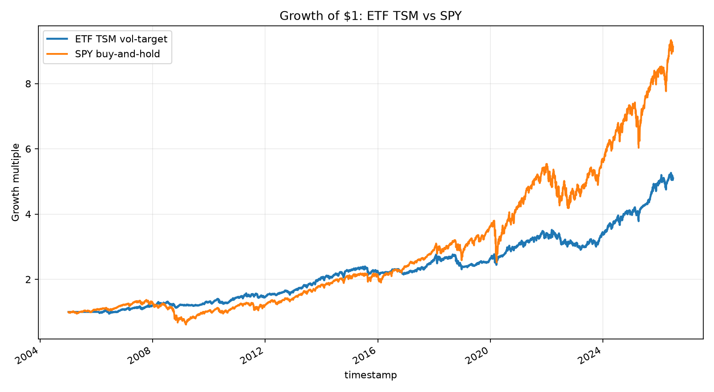
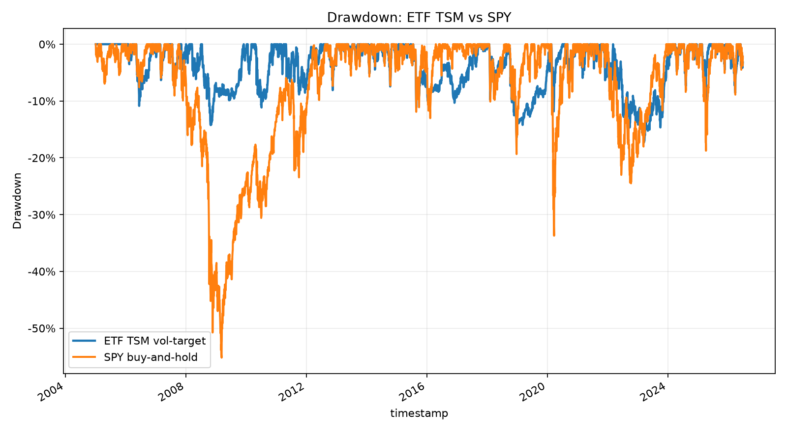

# ETF TSM vs SPY Comparison

This report compares the validation-passed `ETFTimeSeriesMomentumVolTarget-v1` Experiment against a SPY buy-and-hold benchmark using the same cached Yahoo adjusted daily data panel.

Important scope: this is SPY-relative vectorized research evidence. It supports the resume/project story, but paper/live approval remains separate; simulated runtime replay evidence lives in `docs/reports/etf_tsm_engine_replay/etf_tsm_engine_replay.md`.

## Inputs

- Symbols: SPY, QQQ, IWM, IEF, GLD, SHY, DBC
- Date range: 2005-01-03 14:30:00+00:00 to 2026-06-29 13:30:00+00:00
- Bars: 5405
- Data source: cached Yahoo Chart adjusted daily OHLCV (`data/parquet/equity/yahoo_chart`)
- Starting equity: $10,000
- Strategy: 12-month absolute momentum, top 3 positive-trend ETFs, inverse-volatility weighting, 10% annual volatility target, SHY defensive fallback

## Headline Metrics

| Metric | ETF TSM vol-target | SPY buy-and-hold |
| --- | ---: | ---: |
| Total return | 4.09x | 8.13x |
| CAGR | 7.89% | 10.86% |
| Sharpe | 0.7954 | 0.6388 |
| Sortino | 1.0009 | 0.7805 |
| Annual volatility | 10.20% | 18.96% |
| Max drawdown | -17.30% | -55.19% |
| Final equity | $50,944.37 | $91,284.71 |

## SPY-relative diagnostics

- Strategy/SPY daily return correlation: `0.5414`
- Annualized active return vs SPY: `-4.00%`
- Rebalances: `258`
- Skipped rebalances: `13`
- Trade rows: `776`

## Charts

## Interpretation

The strategy's resume value is not only the return profile; it is the disciplined process: the hypothesis was source-backed, frozen before validation, passed WFA/MC/DSR/stability, and remains explicitly marked as not paper/live approved until operational gates are completed.
